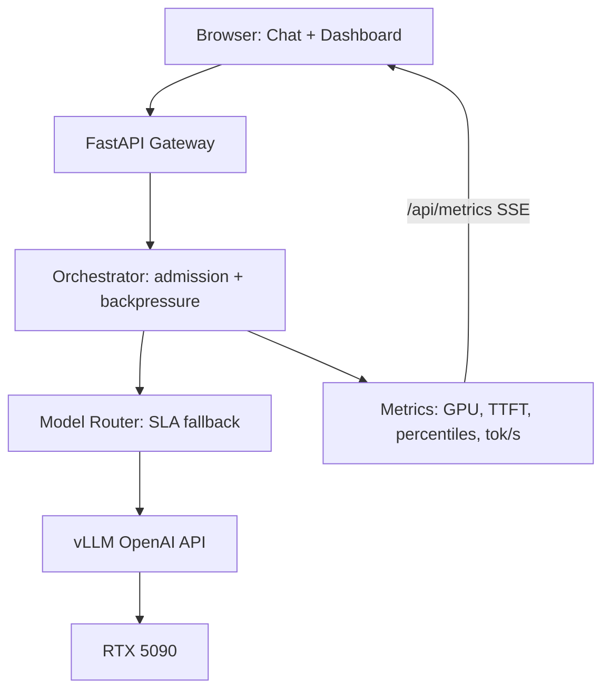

# LLM Inference Engineering Platform

A production-minded inference gateway and measurement stack on a bare-metal **NVIDIA RTX 5090**, serving **Qwen2.5-VL** through **vLLM**, with a FastAPI admission-control layer, real-time GPU/latency observability, multi-model SLA routing, and reproducible benchmark results.

This is not "I got a model running." It is instrumentation, overload behavior, quantization trade-offs, and the prefill/decode asymmetry that production serving stacks are built around — measured on real hardware, with numbers committed to the repo.

## Architecture

```text
Browser (chat UI + /dashboard)
        |
        v
FastAPI gateway
  - AsyncOpenAI proxy
  - asyncio admission control (queue depth, concurrency ceiling, HTTP 429)
  - TTFT / wait / processing latency tracking
  - SLA-aware multi-model router
        |
        +-----> primary backend (vLLM: Qwen2.5-VL-7B)
        |
        +-----> optional fast backend (fallback under SLA breach)
        |
        v
NVIDIA RTX 5090 (WSL2 / CUDA)
```



## Inference engineering features

| Feature | What it demonstrates | Evidence |
| --- | --- | --- |
| Admission control + continuous batching | Bounded in-flight concurrency; overload becomes queue delay, not crashes | [`RESULTS.md`](RESULTS.md) |
| `/api/metrics` + live dashboard | GPU util/VRAM, queue depth, tokens/s, P50/P95/P99, TTFT | `/dashboard`, [`app/metrics.py`](app/metrics.py) |
| Streaming + TTFT | First-token latency separated from total latency | SSE `done` payload includes `ttft_ms` |
| Multi-model SLA routing | Spill to fallback when p95 TTFT breaches SLA | [`router/RESULTS.md`](router/RESULTS.md) |
| Quantization suite | FP16 vs bitsandbytes INT8 vs AWQ INT4 | [`quantization/RESULTS.md`](quantization/RESULTS.md) |
| Prefill / decode asymmetry | Empirical motivation for disaggregation; honest single-GPU fallback | [`disaggregation/RESULTS.md`](disaggregation/RESULTS.md) |

### Headline numbers (live RTX 5090)

From [`RESULTS.md`](RESULTS.md) — text concurrency sweep through the gateway (`MAX_CONCURRENCY=8`):

| Concurrency | ~Throughput (tok/s) | TTFT p50 | Total p50 |
| ---: | ---: | ---: | ---: |
| 1 | 138 | 67 ms | 2.1 s |
| 8 | 1043 | 82 ms | 2.1 s |
| 16 | 1043 | 843 ms | 2.9 s |

Throughput scales nearly linearly to the concurrency ceiling, then plateaus while queued requests absorb delay — admission control working as designed. GPU stayed ~98% utilized at concurrency ≥ 4.

## Repository layout

```text
.
├── app/
│   ├── main.py              # FastAPI gateway (async, streaming, metrics)
│   ├── orchestrator.py      # Admission control + request tickets
│   ├── metrics.py           # NVML GPU + rolling latency/throughput
│   ├── router.py            # SLA-aware multi-backend routing
│   ├── static/              # Chat UI + /dashboard
│   ├── Dockerfile
│   └── requirements.txt
├── benchmarks/
│   ├── bench_client.py      # Async load generator → CSV
│   ├── plot_results.py
│   ├── router_load_test.py
│   ├── prefill_decode_probe.py
│   └── results/             # Committed CSVs + charts
├── RESULTS.md               # Orchestrator / concurrency findings
├── router/RESULTS.md
├── quantization/RESULTS.md
├── disaggregation/RESULTS.md
└── LICENSE
```

## Quick start

### Prerequisites

- Windows 11 + NVIDIA GPU (this project was measured on RTX 5090)
- WSL 2 (Ubuntu) with CUDA visible via `nvidia-smi`
- vLLM serving an OpenAI-compatible API (native venv or Docker)
- Python 3.11+ for the gateway

### 1. Serve the model (WSL)

Example (adjust path/venv to yours):

```bash
vllm serve Qwen/Qwen2.5-VL-7B-Instruct \
  --served-model-name Qwen/Qwen2.5-VL-7B-Instruct \
  --host 0.0.0.0 \
  --port 8080 \
  --dtype auto \
  --max-model-len 4096 \
  --gpu-memory-utilization 0.85 \
  --limit-mm-per-prompt '{"image":4}'
```

Verify:

```bash
curl http://127.0.0.1:8080/v1/models
```

> **Tip:** On this Blackwell + WSL2 setup, `--gpu-memory-utilization 0.9` left too little KV-cache headroom and crashed under concurrency ≥ 4. `0.85` held through concurrency 32. Details in [`RESULTS.md`](RESULTS.md).

### 2. Run the gateway

```bash
cd app
python -m venv .venv
# Windows: .venv\Scripts\activate
# WSL/Linux: source .venv/bin/activate
pip install -r requirements.txt
cp .env.example .env
# edit OPENAI_BASE_URL / MODEL_NAME if needed
uvicorn main:app --host 0.0.0.0 --port 3000 --reload
```

Open:

- Chat UI: http://127.0.0.1:3000
- Metrics dashboard: http://127.0.0.1:3000/dashboard
- JSON metrics: http://127.0.0.1:3000/api/metrics
- Router status: http://127.0.0.1:3000/api/router/status

### 3. Reproduce benchmarks

```bash
pip install -r benchmarks/requirements.txt
python benchmarks/bench_client.py \
  --base-url http://127.0.0.1:3000 \
  --concurrency 1 4 8 16 \
  --requests-per-level 16 \
  --out benchmarks/results/text_sweep.csv
python benchmarks/plot_results.py benchmarks/results/text_sweep.csv
```

## API surface

| Method | Path | Purpose |
| --- | --- | --- |
| `POST` | `/api/chat` | Chat completions (SSE streaming by default) |
| `GET` | `/api/health` | Liveness + model endpoint |
| `GET` | `/api/models` | Upstream model list |
| `GET` | `/api/metrics` | Snapshot: GPU, queue, latency percentiles, tok/s |
| `GET` | `/api/metrics/stream` | Same payload over SSE (~1 Hz) |
| `GET` | `/api/router/status` | Per-backend SLA / degradation state |
| `GET` | `/dashboard` | Live Chart.js dashboard |

Environment knobs (see [`app/.env.example`](app/.env.example)):

| Variable | Role |
| --- | --- |
| `OPENAI_BASE_URL` / `VLLM_BASE_URL` | Upstream OpenAI-compatible base |
| `MODEL_NAME` | Primary served model id |
| `MAX_CONCURRENCY` | In-flight admission ceiling |
| `MAX_QUEUE_DEPTH` | Queue cap before HTTP 429 |
| `FAST_BASE_URL` | Optional fallback backend |
| `SLA_TTFT_MS` | p95 TTFT threshold that triggers spillover |

## Multi-model SLA routing

Set `FAST_BASE_URL` (+ `FAST_MODEL_NAME`) to enable a second backend. When the primary's rolling p95 TTFT exceeds `SLA_TTFT_MS`, new requests spill to `fast` instead of queueing forever.

On this single-GPU WSL2 host, launching two concurrent vLLM engines repeatedly crashed the GPU-passthrough VM (memory visibility mismatch). The router was still load-tested end-to-end against one physical engine with two independent admission controllers — see [`router/RESULTS.md`](router/RESULTS.md). Given a stable multi-engine host, the same code routes across distinct models/GPUs.

## Quantization and disaggregation

- **Quantization:** same Qwen2.5-7B-Instruct checkpoint in FP16, bitsandbytes INT8, and AWQ INT4 — AWQ won on latency and peak throughput on this GPU. [`quantization/RESULTS.md`](quantization/RESULTS.md)
- **Disaggregation:** measured prefill vs per-token decode cost scaling; documented the real vLLM `kv_transfer_config` surface; did **not** fake a two-process run on one GPU. [`disaggregation/RESULTS.md`](disaggregation/RESULTS.md)

## Docker (gateway only)

The FastAPI app can run in Docker while vLLM stays in WSL (or another host):

```bash
# from repo root — point OPENAI_BASE_URL at the host-published vLLM port
docker compose up -d --build
```

When the gateway is in Docker and vLLM is on the host, use `http://host.docker.internal:8080/v1`.

## Remote access (optional)

- **Tailscale Serve** — private to your tailnet
- **Tailscale Funnel** — public HTTPS; expose the FastAPI gateway only, never raw vLLM

Always put API keys / auth in front of any public Funnel URL.

## Security checklist

- Distinct secrets for gateway vs vLLM when both are exposed
- Never ship backend secrets into browser JS
- Bound `MAX_OUTPUT_TOKENS`, request timeouts, and queue depth
- Validate image size / MIME types (client enforces a 4MB upload cap)
- Disable Funnel when not needed

## Findings report (PDF)

A shareable write-up with architecture summary, tables, and all benchmark charts:

- [`docs/Inference_Engineering_Report.pdf`](docs/Inference_Engineering_Report.pdf)
- Regenerate: `python docs/generate_report_pdf.py`

## Deploy / Funnel

See [`DEPLOY.md`](DEPLOY.md) for Vercel environment variables and Tailscale Funnel notes.  
One-shot local stack helper: [`scripts/start-wsl-vllm-and-funnel.ps1`](scripts/start-wsl-vllm-and-funnel.ps1).

## License

MIT — see [`LICENSE`](LICENSE).
