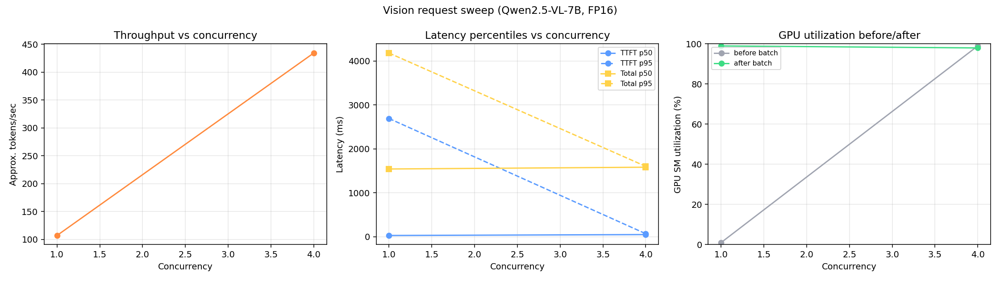
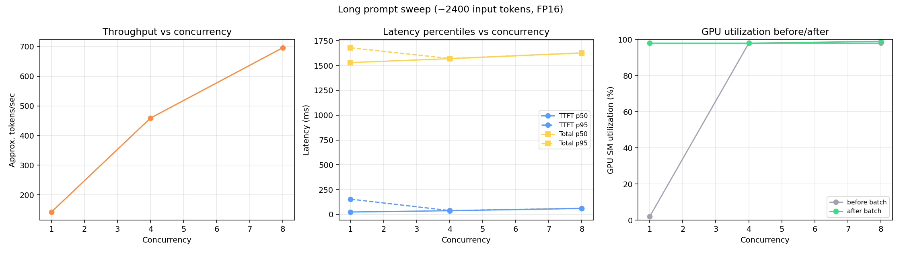

# Benchmark results — admission control and throughput

Measured against **Qwen2.5-VL-7B-Instruct** (vLLM, FP16, `--max-model-len 4096`) on an **NVIDIA RTX 5090 (32GB)**, through this repo's FastAPI gateway (not direct to vLLM).

Raw data: [`benchmarks/results/`](benchmarks/results/).

```bash
python benchmarks/bench_client.py --concurrency 1 4 8 16 --requests-per-level 16 --out benchmarks/results/text_sweep.csv
python benchmarks/plot_results.py benchmarks/results/text_sweep.csv
```

## Crash under load

At concurrency 4 with default `--gpu-memory-utilization 0.9`, vLLM crashed (`EngineCore encountered an issue`) and took down the WSL2 GPU VM (`wsl --shutdown` required). VRAM was ~30.8/32.6GB — little headroom for KV growth.

Restarted with `--gpu-memory-utilization 0.85`. Same sweep then completed at concurrency 4, 8, 16, and 32 with zero errors. Engine build was vLLM `0.19.2rc1.dev` on Blackwell; some instability is expected, but the takeaway is practical: leave headroom and bound in-flight concurrency at the gateway.

## Text concurrency sweep

16 requests per level, `max_tokens=200`, gateway `MAX_CONCURRENCY=8`.

| Concurrency | Throughput (tok/s, approx) | TTFT p50 (ms) | TTFT p95 (ms) | Total p50 (ms) | GPU util after |
| ---: | ---: | ---: | ---: | ---: | ---: |
| 1  | 138.3  | 66.8  | 104.7  | 2059.2 | 98% |
| 4  | 547.1  | 80.7  | 83.3   | 2095.1 | 98% |
| 8  | 1043.2 | 82.3  | 91.0   | 2098.3 | 98% |
| 16 | 1043.1 | 843.4 | 2203.3 | 2866.6 | 98% |


Notes:

- Throughput scales ~linearly from concurrency 1 → 8; TTFT stays ~80–90ms (continuous batching).
- Throughput plateaus at concurrency 8 / 16 — gateway admission limit (`MAX_CONCURRENCY=8`), not idle GPU (still ~98% util).
- At concurrency 16, extra requests queue: TTFT p50 → 843ms, p95 → 2.2s; no failures. `/api/metrics` exposes `wait_ms` vs `processing_ms` separately.

## Vision

Same model, one test image + text prompt.

| Concurrency | Throughput (tok/s, approx) | TTFT p50 (ms) | Total p50 (ms) |
| ---: | ---: | ---: | ---: |
| 1 | 107.1 | 26.7 | 1540.9 |
| 4 | 434.2 | 47.5 | 1581.6 |



For a small image at this concurrency, vision encoder cost is small vs decode. First request at c=1 showed higher TTFT p95/p99 (warm-up); c=4 was stable.

## Long prompt (~2,400 input tokens)

`max_tokens=150`.

| Concurrency | Throughput (tok/s, approx) | TTFT p50 (ms) | Total p50 (ms) |
| ---: | ---: | ---: | ---: |
| 1 | 142.1 | 24.4 | 1530.2 |
| 4 | 458.8 | 37.8 | 1569.3 |
| 8 | 695.8 | 60.7 | 1627.2 |



TTFT stays under 61ms at concurrency 8. Prefill is not the bottleneck at these lengths on this GPU; decode dominates. See [`disaggregation/RESULTS.md`](disaggregation/RESULTS.md) for prefill vs decode timing.

## Summary

1. Lower GPU memory util + gateway concurrency limits avoided the crash path.
2. Throughput scales with concurrency until the admission ceiling, then flattens while queue wait grows.
3. At concurrency ≥ 4, GPU util stays ~98%; the limiter at c=16 is admission queueing, not unused SMs.
