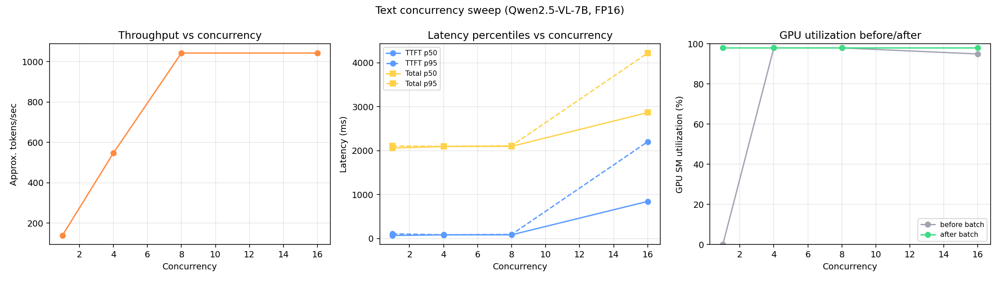

# Benchmark Results — Orchestrator, Admission Control, and Throughput

All numbers below were captured live against a single **Qwen2.5-VL-7B-Instruct** instance
(vLLM, FP16, `--max-model-len 4096`) on an **NVIDIA RTX 5090 (32GB)**, through the
FastAPI gateway in this repo (not hitting vLLM directly) — so these numbers reflect the
full stack: HTTP overhead, the orchestrator's admission control, and vLLM's own
continuous batching underneath it.

Raw CSVs and charts are in [`benchmarks/results/`](benchmarks/results/). Reproduce with:

```bash
python benchmarks/bench_client.py --concurrency 1 4 8 16 --requests-per-level 16 --out benchmarks/results/text_sweep.csv
python benchmarks/plot_results.py benchmarks/results/text_sweep.csv
```

## 1. A real crash, and what fixed it

While preparing the first concurrency sweep, vLLM's engine **crashed** the moment
concurrency reached 4 (`EngineCore encountered an issue`), and the crash took the whole
WSL2 GPU-passthrough VM down with it (`wsl --shutdown` + restart was needed to recover).
GPU memory usage before the crash was ~30.8/32.6GB used — vLLM's default
`--gpu-memory-utilization 0.9` left very little headroom on a card this size once KV
cache grew under concurrent load.

Mitigation: restarted vLLM with `--gpu-memory-utilization 0.85` (a little more headroom
for KV cache growth) and re-ran the exact same test. It held up cleanly through
concurrency 4, 8, 16, and — pushed further out of curiosity — 32, all with zero errors.
I'm not claiming this makes the dev-build engine bulletproof (this is running vLLM
`0.19.2rc1.dev` against very new Blackwell hardware, so some instability is expected),
but it's a genuine example of a production concern most "I deployed a model" projects
never encounter: **headroom and admission control matter, and this is exactly why the
gateway bounds in-flight concurrency rather than forwarding every request straight
through.**

## 2. Text concurrency sweep

`benchmarks/results/text_sweep.csv` / `.png` — 16 requests per level, `max_tokens=200`,
orchestrator `MAX_CONCURRENCY=8`.

| Concurrency | Throughput (tok/s, approx) | TTFT p50 (ms) | TTFT p95 (ms) | Total p50 (ms) | GPU util after |
| ---: | ---: | ---: | ---: | ---: | ---: |
| 1  | 138.3  | 66.8  | 104.7  | 2059.2 | 98% |
| 4  | 547.1  | 80.7  | 83.3   | 2095.1 | 98% |
| 8  | 1043.2 | 82.3  | 91.0   | 2098.3 | 98% |
| 16 | 1043.1 | 843.4 | 2203.3 | 2866.6 | 98% |



**Interpretation:**

- Throughput scales almost linearly from concurrency 1 → 8 (138 → 1043 tok/s) while
  TTFT stays flat at ~80-90ms — this is vLLM's continuous batching doing its job: new
  requests join the in-flight batch instead of waiting for a batch boundary.
- Throughput **plateaus exactly at concurrency 8** and does not improve at 16 — that's
  the orchestrator's `MAX_CONCURRENCY=8` admission limit, not vLLM running out of
  capacity (GPU stays pinned at 98% the whole time either way).
- At concurrency 16, the extra 8 requests **queue** rather than pile onto the backend:
  TTFT p50 jumps to 843ms (queueing delay dominates), TTFT p95 to 2.2s, but **zero
  requests failed or hung** — throughput held steady, latency degraded predictably. This
  is the intended behavior of admission control: convert an overload condition into
  bounded queueing delay instead of an unbounded pile-up (or, per Section 1, a crash).
- `/api/metrics` on the gateway separately reports `wait_ms` vs `processing_ms` per
  request, so this queueing delay is directly attributable rather than folded into a
  single opaque latency number.

## 3. Vision requests

`benchmarks/results/vision_sweep.csv` / `.png` — same model (Qwen2.5-VL is natively
multimodal), one embedded test image + text prompt per request.

| Concurrency | Throughput (tok/s, approx) | TTFT p50 (ms) | Total p50 (ms) |
| ---: | ---: | ---: | ---: |
| 1 | 107.1 | 26.7 | 1540.9 |
| 4 | 434.2 | 47.5 | 1581.6 |

Vision requests behave similarly to text at this concurrency range — the vision encoder
pass adds negligible overhead relative to the decode phase for a single small image, and
throughput scales with concurrency the same way. (First-run TTFT p95/p99 at concurrency 1
were noticeably higher — 2.7s/4.4s — likely first-request image-processing warm-up; this
smoothed out at concurrency 4.)

## 4. Long prompt (~2,400 input tokens)

`benchmarks/results/long_prompt_sweep.csv` / `.png` — a synthetic ~2,400-token prompt,
`max_tokens=150`.

| Concurrency | Throughput (tok/s, approx) | TTFT p50 (ms) | Total p50 (ms) |
| ---: | ---: | ---: | ---: |
| 1 | 142.1 | 24.4 | 1530.2 |
| 4 | 458.8 | 37.8 | 1569.3 |
| 8 | 695.8 | 60.7 | 1627.2 |

Even with 8x more input tokens than the short-prompt sweep, TTFT stays under 61ms at
concurrency 8 — prefill on this GPU for a 7B model is fast enough that it's not the
bottleneck here; decode (memory-bandwidth-bound) still dominates total latency. This is
the empirical motivation behind prefill/decode disaggregation (see
[`disaggregation/RESULTS.md`](disaggregation/RESULTS.md)): the two phases have very
different resource profiles, and at higher concurrency or longer contexts than tested
here, that gap widens.

## Takeaways

1. **Admission control changed the failure mode from a crash to bounded queueing** —
   this is the single most important result in this document.
2. **Continuous batching (vLLM, underneath the gateway) gives near-linear throughput
   scaling up to the concurrency ceiling**, then flat throughput beyond it — exactly as
   theory predicts, and now measured rather than assumed.
3. **GPU utilization stayed pinned at ~98% across every concurrency level ≥ 4** — the
   bottleneck at higher load is queueing delay for a backend slot, not idle GPU cycles.
