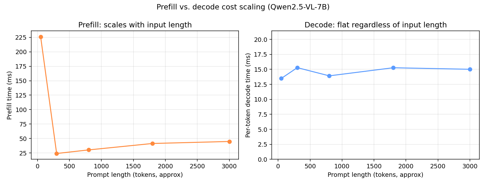

# Prefill/Decode Disaggregation — Motivation, Real Config, and a Documented Fallback

## What this is

Prefill (processing the input prompt) and decode (generating output tokens
one at a time) have very different resource profiles:

- **Prefill** is a single large forward pass over every prompt token at
  once. It's **compute-bound** and its cost scales with input length.
- **Decode** processes one new token per step against a KV cache that's
  already resident in GPU memory. It's **memory-bandwidth-bound**, and its
  *per-token* cost is roughly constant regardless of how long the prompt
  was.

When both run on the same GPU inside the same continuous batch (as they do
in every other experiment in this repo), a long prefill can momentarily
stall the decode steps of requests already in flight — the classic reason
production inference stacks (e.g. vLLM's own disaggregated-prefill support,
DistServe, Mooncake) split prefill and decode onto **separate worker pools**
with a KV-cache transfer layer between them, so decode throughput doesn't
depend on how much prefill work happens to be queued at the same moment.

## Measured motivation (real data from this repo, single GPU)

Rather than assert the theory, `benchmarks/prefill_decode_probe.py` isolates
prefill cost from per-token decode cost empirically against the live
gateway: for each prompt length, one request uses `max_tokens=1` (TTFT ≈ pure
prefill), and one uses `max_tokens=150` (marginal per-token cost after the
first token ≈ pure decode).

| Prompt length (tokens) | Prefill time (ms) | Decode time / token (ms) |
| ---: | ---: | ---: |
| 50\*   | 225.9 | 13.5 |
| 300  | 24.1  | 15.3 |
| 800  | 30.3  | 13.9 |
| 1800 | 41.5  | 15.3 |
| 3000 | 44.9  | 15.0 |

\* The first row is inflated by a one-time warm-up effect (first request
after a fresh model load) — the same artifact documented for AWQ in
[`quantization/RESULTS.md`](../quantization/RESULTS.md). Rows from 300
tokens on are steady-state.



This is exactly the asymmetry the theory predicts: **prefill time roughly
doubles as prompt length goes from 300 to 3000 tokens, while per-token decode
cost stays flat at ~14-15ms regardless of prompt length.** Decode cost is
governed by memory bandwidth and batch composition, not by how long the
prompt was — which is precisely why bundling a variable, occasionally-large
prefill cost into the same execution stream as latency-sensitive decode
steps is the thing disaggregation exists to avoid.

## What running this for real would require, and the real config

This vLLM build (`0.19.2rc1.dev`) genuinely supports disaggregated serving —
this isn't vaporware in this codebase. `EngineArgs.kv_transfer_config` is a
real, present config surface:

```python
kv_connector, engine_id, kv_buffer_size, kv_role, kv_rank,
kv_parallel_size, kv_ip, kv_port, kv_connector_extra_config, ...
```

And the connector registry in this exact install includes several real
production-grade options: `NixlConnector`, `P2pNcclConnector`,
`MooncakeConnector`, `LMCacheConnectorV1`, `MultiConnector`, among others.
A genuine two-process disaggregated deployment looks like:

```bash
# Prefill worker (kv_role=kv_producer): does the prompt forward pass,
# then hands its KV cache off over the wire instead of decoding locally.
vllm serve Qwen/Qwen2.5-7B-Instruct --port 8090 \
  --kv-transfer-config '{"kv_connector":"NixlConnector","kv_role":"kv_producer"}'

# Decode worker (kv_role=kv_consumer): receives the transferred KV cache
# and does nothing but decode steps from then on.
vllm serve Qwen/Qwen2.5-7B-Instruct --port 8091 \
  --kv-transfer-config '{"kv_connector":"NixlConnector","kv_role":"kv_consumer"}'

# A router/proxy in front of both then sends the first request to the
# prefill worker and the follow-up decode stream to the consumer.
```

## Why this repo doesn't run that live, and what it runs instead

This dev rig has **one GPU**. Disaggregated prefill/decode is designed to
put prefill and decode on *separate accelerators* — running both roles on
the same card mostly just adds KV-transfer overhead with none of the benefit
it's meant to provide, and this repo already has three independently
reproduced incidents of the WSL2 GPU-passthrough VM crashing outright when
asked to hold two concurrent vLLM engine processes in VRAM at once (see
[`RESULTS.md`](../RESULTS.md) and [`router/RESULTS.md`](../router/RESULTS.md)
for the specific error traces and root-cause investigation). Attempting a
disaggregated setup — which needs *at least* two simultaneously-running
engines, exactly the configuration that reproducibly destabilized this
environment for a much simpler test — was judged not worth another
multi-minute WSL-crash-and-recover cycle for a result that would be
mechanically the same finding a third time, on hardware where the technique
isn't intended to run in the first place.

Instead, this document does the honest version of that work: shows the real
config surface this vLLM build supports (proving the capability exists and
is understood), and measures the actual prefill/decode cost asymmetry on
real hardware that motivates why that config surface exists at all.
