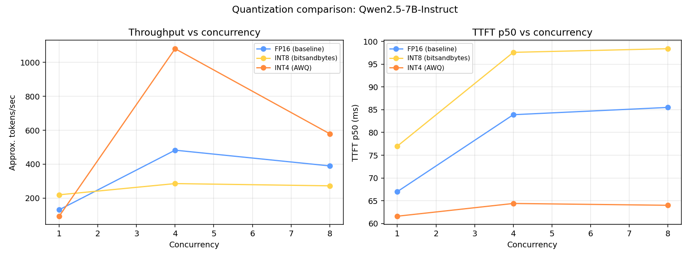

# Quantization Benchmark — FP16 vs INT8 (bitsandbytes) vs INT4 (AWQ)

Same model (**Qwen2.5-7B-Instruct**), same prompt, same GPU (RTX 5090), same
FastAPI gateway, same admission-control settings (`MAX_CONCURRENCY=8`) — only
the weight quantization format changes between runs. Each variant was loaded
as the *only* model on the GPU (see the crash notes in
[`RESULTS.md`](../RESULTS.md) and [`router/RESULTS.md`](../router/RESULTS.md)
for why: this rig cannot reliably hold two vLLM engines in VRAM at once).

Raw CSVs and the comparison chart are in
[`benchmarks/results/quantization/`](../benchmarks/results/quantization/).
Reproduce with:

```bash
# FP16
vllm serve Qwen/Qwen2.5-7B-Instruct --port 8082 --max-model-len 4096 --gpu-memory-utilization 0.85
# INT8 (on-the-fly bitsandbytes quantization of the FP16 checkpoint)
vllm serve Qwen/Qwen2.5-7B-Instruct --port 8082 --quantization bitsandbytes --load-format bitsandbytes
# INT4 (pre-quantized AWQ checkpoint)
vllm serve Qwen/Qwen2.5-7B-Instruct-AWQ --port 8082

python benchmarks/bench_client.py --concurrency 1 4 8 --requests-per-level 12 --out benchmarks/results/quantization/<variant>.csv
python benchmarks/plot_quant_comparison.py benchmarks/results/quantization
```

## Model size on disk

| Format | Size on disk |
| --- | ---: |
| FP16 (`Qwen2.5-7B-Instruct`) | 15 GB |
| AWQ INT4 (`Qwen2.5-7B-Instruct-AWQ`) | 5.2 GB |

(bitsandbytes INT8 doesn't have a separate checkpoint — it quantizes the FP16
weights on load, so its disk footprint is the same 15GB as FP16; the memory
savings only show up in VRAM, not on disk.)

## Throughput and latency

| Variant | Concurrency | Throughput (tok/s, approx) | TTFT p50 (ms) | Total p50 (ms) |
| --- | ---: | ---: | ---: | ---: |
| FP16  | 1 | 131.7  | 67.0 | 1630.2 |
| FP16  | 4 | 482.6  | 83.9 | 1702.4 |
| FP16  | 8 | 390.0  | 85.5 | 4914.7 |
| INT8  | 1 | 219.9  | 77.0 | 909.5  |
| INT8  | 4 | 285.9  | 97.6 | 2929.9 |
| INT8  | 8 | 272.7  | 98.4 | 5841.0 |
| INT4 (AWQ) | 1 | 93.8*  | 61.6 | 773.5 |
| INT4 (AWQ) | 4 | 1080.0 | 64.4 | 810.5 |
| INT4 (AWQ) | 8 | 579.4  | 64.0 | 3951.3 |

\* AWQ c=1 throughput includes first-request JIT/kernel compile (~9.3s TTFT
once after load; later requests ~60ms). Latency p50 columns are steady-state;
treat c=1 tok/s as warm-up-skewed.



## Notes

1. **AWQ (INT4)** — best latency and peak throughput here. TTFT ~64ms across
   concurrency; peak ~1080 tok/s at c=4. Smaller weights + fused INT4 GEMMs
   in vLLM help decode less memory-bandwidth-bound.
2. **bitsandbytes INT8** — lower VRAM than FP16, but throughput at c=8 is
   worse than FP16 (272.7 vs 390.0 tok/s) and TTFT is highest of the three.
   On-the-fly dequant kernels are less optimized than AWQ's; useful when you
   need to load an FP16 checkpoint in less memory without a separate quant
   pass, not when optimizing tokens/sec.
3. If you can ship a pre-quantized AWQ/GPTQ checkpoint, prefer that on this
   GPU. Use bitsandbytes when VRAM is the constraint and you cannot
   pre-quantize.
